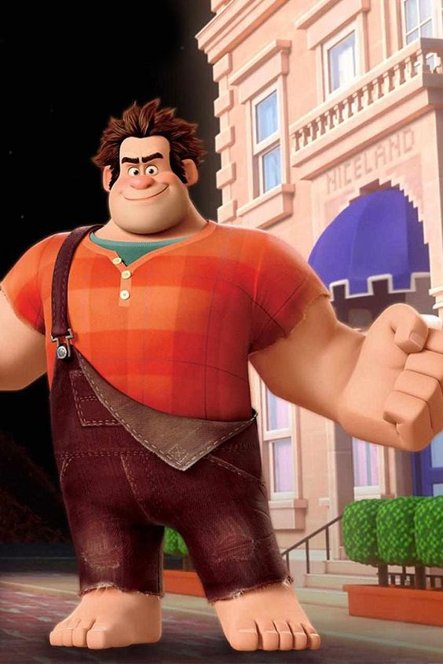
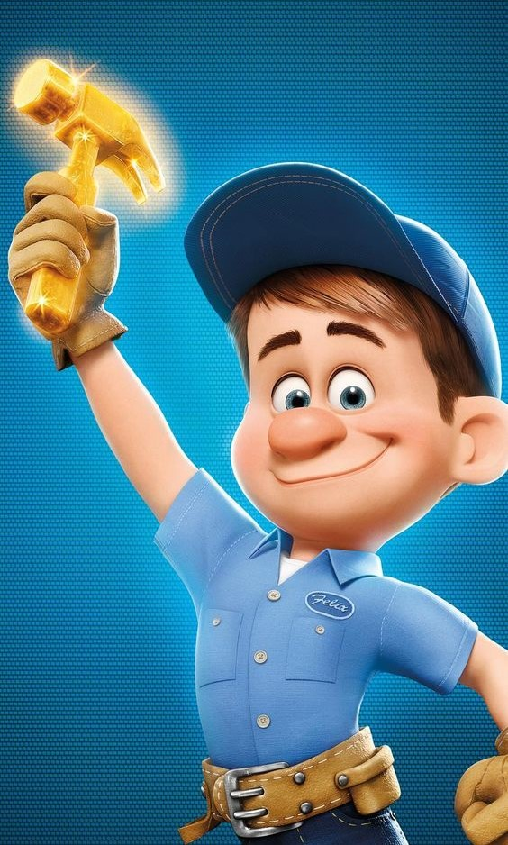
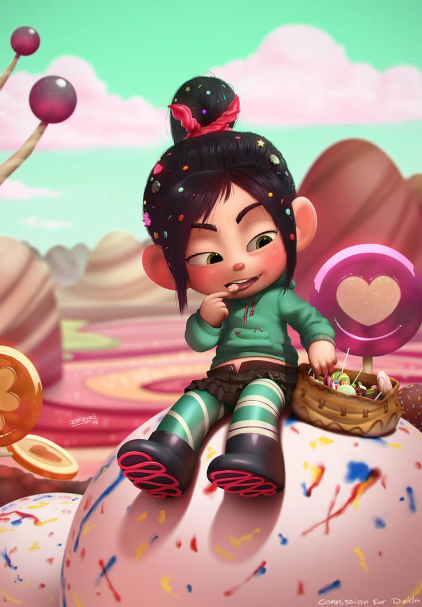
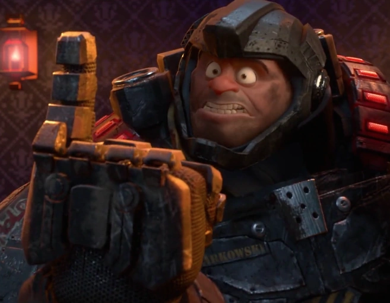
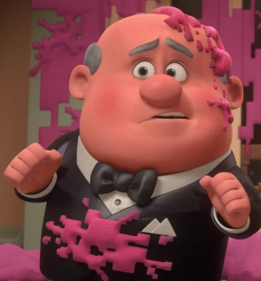
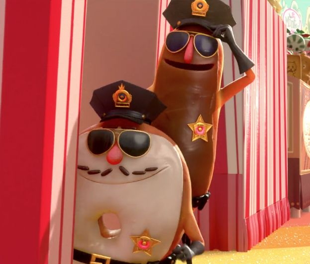
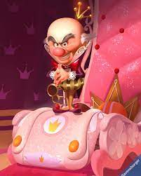
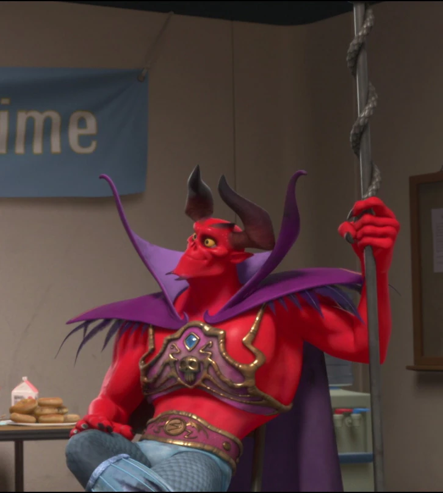
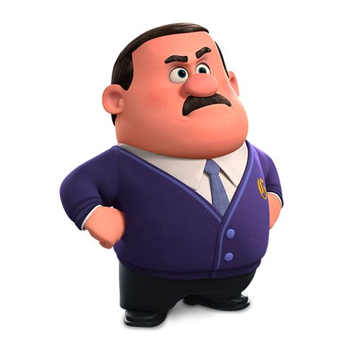
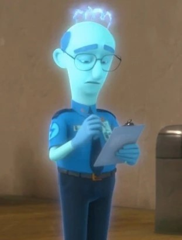

# Jogo de Reação - Detona Ralph Game

## Descrição
O Detona Ralph Game é um jogo de reação em que, conforme o tempo passa, a velocidade aumenta, desafiando o jogador a marcar o máximo de pontos possível. Criado para testar a reação e a atenção do jogador, ele apresenta uma troca constante e aleatória de posições. Dessa forma, proporciona um jogo desafiador e divertido, com o objetivo de marcar o máximo de pontos em 90 segundos.

## Funcionalidades
- **Recovery Life (Recuperação de Vida):** Compreendendo a dificuldade do jogo, em que a velocidade de troca aumenta constantemente e, com isso, a chance de erros aumenta, o jogo recompensa o jogador com 1 Life a cada 10 pontos obtidos, recuperando a vida perdida.
- **Independent Soundtrack (Trilha Sonora Autônoma):** Quando o jogo é carregado, uma trilha sonora leve e animada é tocada automaticamente, enquanto o jogo não é iniciado. Após o seu início, a trilha sonora atual é pausada e substituída por uma nova, carregando uma tensão e emoção.
- **Diversified Game Over (Fim de Jogo Diversificado):** Existem diversos cenários que podem levar ao fim do jogo, e o Detona Ralph Game está preparado para isso. Dependendo da situação, uma mensagem diferente é exibida.
- **Score (Pontuação):** Os pontos são marcados ao atingir o Ralph, ganhando 1 ponto por clique nele.
- **Loss of Life (Perda de Life):** O jogador perde vida quando atinge um personagem diferente do Ralph, perdendo 1 Life no processo. Porém, caso ele atinja o personagem Conserta Felix Jr, ele irá perder 1.5 Life.
- **Responsiveness (Responsividade):** Suporte responsivo para que o jogo se adapte aos diversos tamanhos de tela, oferecendo uma experiência adaptativa e agradável aos jogadores.


## Interface do Jogo em Dispositivos Suportados

<div style="display: flex; justify-content: space-around; align-items: center;">
<figure style="text-align: center;">
    
    <figcaption>Interface Desktop</figcaption>
    <br>
</figure>

<figure style="text-align: center;">
    
    <br>
    <figcaption>Interface Smartphones</figcaption>
</figure>
</div>


## Como Jogar?
- Primeiro acesse o site do jogo através do seguinte link: https://gabrielconstantine.github.io/DetonaRalph-Game/
- O segundo passo é clicar no botão onde está escrito "Jogar".
- O Ralph estará em uma das 16 janelas, assim como outros 15 personagens, e eles vão trocar constantemente de posição a cada 1.5 segundos, mas quando sobrar 50 segundos ou menos, trocarão 1 vez a cada 1 segundo.
- O terceiro passo é atingir o Ralph, clicando nele e assim marcando pontuação, evitando ao maximo atingir outros personagens.

## Lista de Personagens:

<div style="display: flex; justify-content: center; flex-wrap: wrap;">
<figure style="flex: 0 1 20%; max-width: 25%; text-align: center; margin: 10px;">
    
    <br>
    <figcaption>Ralph</figcaption>
</figure>

<figure style="flex: 0 1 20%; max-width: 25%; text-align: center; margin: 10px;">
    
    <br>
    <figcaption>Conserta Felix Jr</figcaption>
</figure>

<figure style="flex: 0 1 20%; max-width: 25%; text-align: center; margin: 10px;">
    
    <br>
    <figcaption>Vanellope</figcaption>
</figure>

<figure style="flex: 0 1 20%; max-width: 25%; text-align: center; margin: 10px;">
    
    <br>
    <figcaption>Sargento Calhoun</figcaption>
</figure>

<figure style="flex: 0 1 20%; max-width: 25%; text-align: center; margin: 10px;">
    
    <br>
    <figcaption>General Hologram</figcaption>
</figure>

<figure style="flex: 0 1 20%; max-width: 25%; text-align: center; margin: 10px;">
    
    <br>
    <figcaption>Taffyta</figcaption>
</figure>

<figure style="flex: 0 1 20%; max-width: 25%; text-align: center; margin: 10px;">
    
    <br>
    <figcaption>Markowski</figcaption>
</figure>

<figure style="flex: 0 1 20%; max-width: 25%; text-align: center; margin: 10px;">
    
    <br>
    <figcaption>Tapper</figcaption>
</figure>

<figure style="flex: 0 1 20%; max-width: 25%; text-align: center; margin: 10px;">
    <br>
    
    <figcaption>Roy</figcaption>
</figure>

<figure style="flex: 0 1 20%; max-width: 25%; text-align: center; margin: 10px;">
    
    <br>
    <figcaption>Wynnchel e Duncan</figcaption>
</figure>

<figure style="flex: 0 1 20%; max-width: 25%; text-align: center; margin: 10px;">
    
    <br>
    <figcaption>Rei Candy</figcaption>
</figure>

<figure style="flex: 0 1 20%; max-width: 25%; text-align: center; margin: 10px;">
    
    <br>
    <figcaption>Candlehead</figcaption>
</figure>

<figure style="flex: 0 1 20%; max-width: 25%; text-align: center; margin: 10px;">
    
    <br>
    <figcaption>Deanna</figcaption>
</figure>

<figure style="flex: 0 1 20%; max-width: 25%; text-align: center; margin: 10px;">
    
    <br>
    <figcaption>Satine</figcaption>
</figure>

<figure style="flex: 0 1 20%; max-width: 25%; text-align: center; margin: 10px;">
    
    <br>
    <figcaption>Gene</figcaption>
</figure>

<figure style="flex: 0 1 20%; max-width: 25%; text-align: center; margin: 10px;">
    
    <br>
    <figcaption>Surge Protector</figcaption>
</figure>
</div>


## Tecnologias Utilizadas
- HTML5
- CSS3
- JavaScript
- Node.js

## Estrutura do Projeto

```plaintext
DetonaRalph-Game/
├── public
│   ├── img/
│   │   ├── button-play.png
│   │   ├── Candlehead.jpeg
│   │   ├── Conserta-FelixJr.jpg
│   │   ├── Deanna.jpg
│   │   ├── Gene.jpg
│   │   ├── General-Hologram.jpg
│   │   ├── Markowski.webp
│   │   ├── Player.png
│   │   ├── Ralph.jpg
│   │   ├── RalphIcon.png
│   │   ├── Rei-Candy.jpeg
│   │   ├── Roy.webp
│   │   ├── Satine.webp
│   │   ├── Sgt-Calhoun.jpg
│   │   ├── Surge-Protector.jpg
│   │   ├── Taffyta.webp
│   │   ├── Tapper.webp
│   │   ├── Vanellope.jpg
│   │   ├── wall.png
│   │   ├── Interface-PC.png
│   │   ├── Interface-Mobile.png
│   │   ├── Wallpapper-Window.jpg
│   │   └── Wynnchel-Duncan.jpg
│   ├── scripts/
│   │   ├── gameEngine.js
│   │   └── responsiveGame.js
│   ├── sounds/
│   │   ├── GameSound.mpeg
│   │   └── MenuGame.mpeg
│   ├── style/
│   │   ├── gamePage.css
│   │   └── reset.css
├── index.html
└── README.md
```